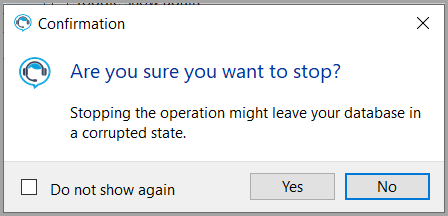

# About

This is a code sample to show how to create a **do not show again** dialog.



Information for the dialog for this example resides in appsettings.json

```json
{
  "ShowAgain": true,
  "Heading": "Are you sure you want to stop?",
  "Text": "Stopping the operation might leave your database in a corrupted state.",
  "Caption": "Confirmation",
  "VerificationText": "Do not show again",
  "MainSettings": {
    "Logging": {
      "LogLevel": {
        "Default": "Information"
      }
    },
    "ConnectionStrings": {
      "MainConnection":
        "Data Source=(localdb)\\\\MSSQLLocalDB;Initial Catalog=MockupApplication;Integrated Security=True"
    }
  }

}
```

- ShowAgain when true means to show the dialog while false indicates not to show the dialog. There is a checkbox to toggle this property.
- VerificationText is the text for do not show again
- Caption is the text title for the dialog
- Heading in this case text for a question
- Text is sub text of heading


## Model

The following class/model stores settings from appsettings.json.

There is more information stored e.g. a database connection string as many applications will have other settings besides do not show again.

```csharp
public class ApplicationSettings
{
    public bool ShowAgain { get; set; }
    public string Heading { get; set; }
    public string Text { get; set; }
    public string Caption { get; set; }
    public string VerificationText { get; set; }
    public MainSettings MainSettings { get; set; }
}
public class MainSettings
{
    public required Logging Logging { get; set; }
    public required ConnectionString ConnectionStrings { get; set; }
}

public class Logging
{
    public Loglevel LogLevel { get; set; }
}

public class Loglevel
{
    public string Default { get; set; }
}

public class ConnectionString
{
    public string MainConnection { get; set; }
}
```